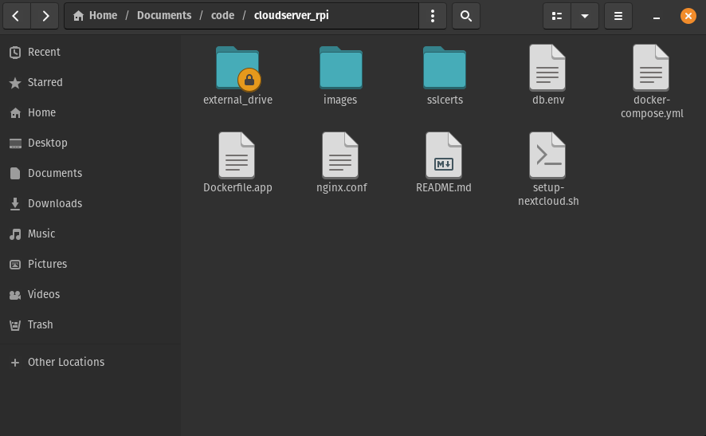

<p align="center">
<h2 align="center">Como ter sua própria nuvem de hospedagem de arquivos</h3>
<p align="center">
  Um guia passo a passo para criar seu próprio servidor de nuvem em casa, usando Nextcloud e Docker sem depender de serviços de big techs como Google Drive ou Dropbox!
</p>

## 🚀 Por que fazer isso?  
- Ter **controle total** sobre seus arquivos, uma vez que não irão depender de nenhuma big tech.  
- Acesso remoto seguro aos seus dados.  
- Personalização com plugins.
- Economia a longo prazo (sem taxas de assinatura).  

<p align="center">
  <a href="https://github.com/arthurcorona">
    
  </a>
</p>
<p align="center">

	
   <a href="https://www.linkedin.com/in/arthur-corona-32a155216/">
    
  </a>
	
  <a href="https://www.x.com/imarthurcorona">
    
  </a>
</p>

## 📋 Pré-requisitos  
- Uma máquina para utilizar de servidor (eu utilizo um Raspberry PI 4).  
- Docker e Docker Compose instalados.
- Domínio (não é obrigatório, mas é recomendado para ativar o SSL).  

## 🛠️ Passo a Passo  

### 1. Instalar Docker e Docker Compose  
```bash
sudo apt update && sudo apt install docker docker-compose -y
sudo systemctl enable --now docker
```

### 2. Criar as pastas do Nextcloud
Antes de criar o "external_drive", use o sudo fdisk -l para ver os discos, e escolha o que quiser.

```bash

mkdir /external_drive

sudo mount /dev/sdc3 /external_drive 

echo "/dev/sdc3 /external_drive ext4 defaults 0 0" | sudo tee -a /etc/fstab

sudo mkdir external_drive
cd external_drive
sudo mkdir nextcloud apps config data theme 
```
### 3. Criar os arquivos do nextcloud

#### Arquivos: Dockerfile.app; nginx.conf; setup-nextcloud.sh; db.env; docker-compose.yml 
Lembrando que os arquivos não são totalmente necessários, entretanto, todos possuem uma função importante.</p>
<p>O <a href="https://docs.docker.com/compose/">docker-compose</a> melhora a organização e manutenção, sendo um arquivo de orquestração.</p>
<p>O db.env organiza melhor as informações sensíveis.</p>
<p>O <a href="https://www.f5.com/go/product/welcome-to-nginx">Nginx</a> é um arquivo para a configuração do proxy reverso, para aumentar a segurança.</p>
<p>O Dockerfile é um arquivo para customizar o container do nextcloud.</p>

<p>
Caso queira instalar eles, apenas faça o download dos no diretório do repositório no github e faça as alterações necessárias para você. 
</p>
Coloquei informações de exemplo, para evitar vazar dados sensíveis.
 
### Rodar o docker

```bash
# O comando -p 80:80 está mapeando a porta 80 do container pra porta 80 do pc
sudo docker run -d -p 80:80 --name nextcloud --restart unless-stopped \
-v /external_drive/nextcloud:/var/www/html \
-v /external_drive/apps:/var/www/html/custom_apps \
-v /external_drive/config:/var/www/html/config \
-v /external_drive/data:/var/www/html/data \
-v /external_drive/theme:/var/www/html/themes \
nextcloud
```

## 🛡️ Incrementando segurança: 

  <h3>Criar usuários com permissões mínimas.</h3>
<p>   1. Entre no Nextcloud com uma conta de administrador</p>
<p>   2. Vá até a seção de usuários e crie um novo</p>
<p>   3. Preencha o usuário, senha, e-mail.</p>
<p>   4. Desmarque a opção "Administrador" se ela estiver ativada.</p>
<p>   5. Agora você precisa acessar o app e definir as permissões</p>

  ### Adicionando certificado SSL
<h4>  Configurar o domínio</h3>

<p>   Depois de obter o domínio:</p>

</p>1. Acesse o painel do seu domínio e atualize o registro A para apontar para seu IP público</p>
<p>2. Para baixar a pasta com os certificados:</p>
<p>3. Necessário instalar o Certbot e o Nginx para fazer proxy reverso.</p>

```bash
sudo apt update
sudo apt install nginx certbot python3-certbot-nginx
```
Criar um arquivo novo :
```bash
sudo nano /etc/nginx/sites-available/nextcloud

# e adicionar: 
server {
#obs: IP e dominio de exemplo por questões de segurança.
#obs2: lembre-se de pegar o IP público, e não da sua máquina. Tive uma boa dor de cabeça por causa de uma "besteira" dessas.

    listen 80;
    server_name nuvem.seudominio.com;

    location / {
        proxy_pass http://111.1.1.1:80;
        proxy_set_header Host $host;
        proxy_set_header X-Real-IP $remote_addr;
        proxy_set_header X-Forwarded-For $proxy_add_x_forwarded_for;
        proxy_set_header X-Forwarded-Proto $scheme;
    }
}
```

```bash


<p>Baixar os arquivos de certificado</p>

$ sudo docker compose run --rm certbot certonly \
  --manual \
  --preferred-challenges dns \
  -d seudominio.com.br \
  --email seuemail@email.com \
  --agree-tos \
  --no-eff-email

```
<p> Deverá retornar algo como: </p>

```bash

  [+] Creating 3/3
 ✔ Container storage_server-db-1           Running                         0.0s 
 ✔ Container storage_server-app-1          Running                         0.0s 
 ✔ Container storage_server-nginx-proxy-1  Running                         0.0s 
Saving debug log to /var/log/letsencrypt/letsencrypt.log
Requesting a certificate for coronacloud.com.br

- - - - - - - - - - - - - - - - - - - - - - - - - - - - - - - - - - - - - - - -
Please deploy a DNS TXT record under the name:

_acme-challenge.seudominio.com.br.

with the following value:

códigoxxx

Before continuing, verify the TXT record has been deployed. Depending on the DNS
provider, this may take some time, from a few seconds to multiple minutes. You can
check if it has finished deploying with aid of online tools, such as the Google
Admin Toolbox: https://toolbox.googleapps.com/apps/dig/#TXT/_acme-challenge.coronacloud.com.br.
Look for one or more bolded line(s) below the line ';ANSWER'. It should show the
value(s) you've just added.

- - - - - - - - - - - - - - - - - - - - - - - - - - - - - - - - - - - - - - - -
Press Enter to Continue

```

<p>Apenas siga as instruções.</p>


mkdir sslcerts
sudo cp /etc/letsencrypt/live/<dominio>/fullchain.pem ./sslcerts/coronacloud.com.br.crt
sudo cp /etc/letsencrypt/live/<dominio>/privkey.pem ./sslcerts/coronacloud.com.br.key
sudo cp /etc/ssl/certs/dhparam.pem ./sslcerts/dhparam.pem  # Se você tiver o Diffie-Hellman


Criar uma pasta de validação do webroot:

```bash
sudo mkdir -p /home/user/projeto/nextcloud/webroot
```

Execute o Certbot:

```bash
sudo certbot certonly --webroot \
-w /home/user/projeto/nextcloud/webroot \
-d seudominio.com
```
<p>O Certbot colocará arquivos temporários em /webroot/.well-known/acme-challenge/ para que o Let's Encrypt valide que você é dono do domínio.</p>

<p>Copie os arquivos de certificado para o SSL</p>

```bash
/etc/letsencrypt/live/coronacloud.com.br/

cp /etc/letsencrypt/live/seudominio.com.br/fullchain.pem sslcerts/coronacloud.com.br.crt
cp /etc/letsencrypt/live/seudominio.com.br/privkey.pem sslcerts/coronacloud.com.br.key
```

Gere o dhparam com:

```bash
openssl dhparam -out sslcerts/dhparam.pem 2048
```
<p>O gerenciador de arquivos deve ficar parecido com isso:</p>


<p>Lembrando que o Lets Encrypt expira o certificado a cada 90 dias, e, para isso, deve-se fazer o seguinte:

```bash
#Para renovar e copiar os aquivos
sudo crontab -e

0 3 * * * certbot renew --quiet && cp /etc/letsencrypt/live/coronacloud.com.br/fullchain.pem /home/usuario/projetos/nextcloud/sslcerts/coronacloud.com.br.crt && cp /etc/letsencrypt/live/coronacloud.com.br/privkey.pem /home/usuario/projetos/nextcloud/sslcerts/coronacloud.com.br.key
```

Caso queira gerar o certificado usando o Docker (opcional)


```bash
docker-compose run --rm certbot certonly --webroot \
  --webroot-path=/var/www/certbot \
  --email seuemail@exemplo.com \
  --agree-tos \
  --no-eff-email \
  -d seudominio.com.br
```

Após isso, ative e teste o site:
```bash
sudo ln -s /etc/nginx/sites-available/nextcloud /etc/nginx/sites-enabled/
sudo nginx -t
sudo systemctl reload nginx
```
Para obter o certificado SSL com Let´s Encrypt, use: 
```bash
sudo certbot --nginx -d nuvem.seudominio.com
```
Após isso, teste seu domínio no navegador.


